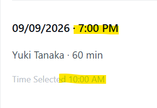

# Bug Report

| ID| Title| Severity| Priority | System / Env| Prerequisites| Steps to Reproduce| Expected Result| Actual Result| Evidence | Suspected Area|
|---------|-------------------------------------------------------------|----------|----------|---------------------------------------------|---------------------------------------------|-------------------------------------------------------------------------------------------------------------------------------------------------------------------------------------------------------------------|---------------------------------------------------------------------------------------------------|---------------------------------------------------------------------------------------------------|----------|-----------------------------------------------------|
| BUG-001 | Booked time does not match the slot selected on booking form | Critical | Critical | Chrome 152.0.7977.76, Windows, 1669x945, 7391 |                                             | 1. Go to coaches tab 2. Select 'book' for coach 3. Select an available timeslot and note time selected 4. Confirm booking 5. Navigate to 'My Sessions' 6. Check displayed timeslot against selected | Time displayed in 'My Sessions' should match time selected during booking| Time displayed does not match, no pattern identified|  | Create or fetch session bookings                     |
| BUG-002 | Coaches times are not released when a session is cancelled   | High     | High     | Chrome 152.0.7977.76, Windows, 1669x945, 7391 | User has at least one booked session         | 1. Book a session with a coach 2. Cancel the session 3. Navigate to the coaches 'book' session page                                                                                                          | Cancelled slot should reappear as available for booking                                           | Cancelled slot remains blocked/unavailable                                                        |          | Session cancellation logic not updating availability |
| BUG-003 | Users booked session times not blanked out with other coach  | Low      | Review after BUG‑001 fix | Chrome 152.0.7977.76, Windows, 1669x945, 7391 |                                             | Blocked by BUG-001: difficult to reproduce 1. Book a session with Coach A 2. Attempt to book same timeslot with Coach B                                                                                      | Timeslot should be blocked/greyed out for other coaches                                           | Timeslot appears available, can be booked. Does not reserve same slot possibly due to BUG-001     |          | Availability filter not including user bookings      |
| BUG-004 | Users booked sessions not ordered by time                    | Low      | Review after BUG‑001 fix | Chrome 152.0.7977.76, Windows, 1669x945, 7391 | User has multiple sessions booked            | Blocked by BUG-001: difficult to reproduce 1. Book multiple sessions across different times 2. Navigate to 'My Sessions' tab                                                                                  | Sessions listed chronologically                                                                  | Some sessions appear unordered                                                                   |          | Sorting logic in session list rendering              |
| BUG-006 | Upcoming sessions count not decreasing when cancelled        | Low      | Medium   | Chrome 152.0.7977.76, Windows, 1669x945, 7391 | User has upcoming sessions booked            | 1. Observe 'Upcoming sessions' count 2. Cancel upcoming session(s) 3. Navigate to dashboard                                                                                                                  | Count should decrease by one each time a session is cancelled                                    | Count does not decrease when sessions are cancelled                                              |          | Delete session booking                               |
| BUG-007 | Find a coach search broken pagination                        | Low      | Low      | Chrome 152.0.7977.76, Windows, 1669x945, 7391 | User searches for a coach with filters       | 1. Search for a coach with specific criteria 2. Navigate to page 2 or 3                                                                                                                                         | Only matching coaches should appear on subsequent pages                                          | Non‑matching coaches still displayed                                                             |          | Pagination of coach search                           |
| BUG-008 | Book a session allows non‑emails in 'invite'                 | Low      | Medium   | Chrome 152.0.7977.76, Windows, 1669x945, 7391 | User is booking a session with invite field  | 1. Book a session 2. Enter non‑email string in 'invite' field 3. Confirm booking                                                                                                                             | System should validate input and reject non‑emails                                               | Non‑emails accepted, booking proceeds                                                            |          | Input validation for invite field                    |
| BUG-009 | Different date formats on booking vs sessions pages          | High     | High     | Chrome 152.0.7977.76, Windows, 1669x945, 7391 | User has a session booked with differing day/month | 1. Book a session on a date where day and month differ 2. Observe dd/mm/yyyy format when booking                                                                                                                | Date should be displayed in dd/mm/yyyy format on sessions page                                   | Dates displayed in mm/dd/yyyy format on sessions page                                             |          | Date format in storage or sessions page logic        |
Tips